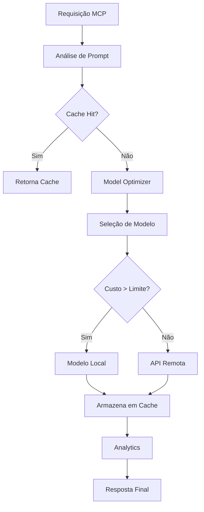

# MCP Token Saver - Arquitetura do Sistema

## Visão Geral

O MCP Token Saver é um servidor MCP (Model Context Protocol) avançado projetado para economizar tokens e reduzir custos ao trabalhar com APIs de LLM, especialmente Moonshot AI. O sistema implementa várias estratégias de otimização baseadas nos insights de projetos open-source da comunidade.

```
┌─────────────────────────────────────────────────────────────────┐
│                        MCP Token Saver                          │
├─────────────────────────────────────────────────────────────────┤
│  ┌───────────────┐  ┌──────────────┐  ┌─────────────────────┐   │
│  │   MCP Server  │  │ Cache Engine │  │ Model Optimizer     │   │
│  │   (main.ts)   │◄─┤ (Redis/File) │◄─┤ (Smart Selection)   │   │
│  └───────────────┘  └──────────────┘  └─────────────────────┘   │
│           │                                      │              │
│  ┌───────────────┐  ┌──────────────┐  ┌─────────────────────┐   │
│  │   Template    │  │  Analytics   │  │ Provider Factory    │   │
│  │   Engine      │  │  Dashboard   │  │ (Multi-LLM)         │   │
│  └───────────────┘  └──────────────┘  └─────────────────────┘   │
└─────────────────────────────────────────────────────────────────┘
```

## Componentes Principais

### 1. **Servidor MCP Principal** (`src/main.ts`)
- **Função**: Ponto de entrada e coordenação central
- **Responsabilidades**:
  - Configuração e inicialização de componentes
  - Roteamento de ferramentas MCP
  - Gerenciation de ciclo de vida
  - Otimizações programadas

### 2. **Cache Engine** (`src/core/CacheEngine.ts`)
- **Função**: Cache inteligente multi-camada
- **Estratégias**:
  - Cache em memória (Redis opcional)
  - Cache em disco persistente
  - Compressão LZ-String
  - Heurísticas de invalidação
- **Baseado em**: Letta/MemGPT para gerenciamento de memória

### 3. **Model Optimizer** (`src/services/ModelOptimizer.ts`)
- **Função**: Seleção inteligente de modelo
- **Algoritmos**:
  - Análise de custo-benefício
  - Detecção automática de tipo de tarefa
  - Fallback para modelos locais
- **Baseado em**: LiteLLM Gateway para roteamento

### 4. **Template Engine** (`src/templates/TemplateEngine.ts`)
- **Função**: Sistema de templates reutilizáveis
- **Recursos**:
  - Templates categorizados
  - Variáveis dinâmicas
  - Otimização de tokens
  - Análise de eficiência

### 5. **Analytics & Dashboard** (`src/analytics/`)
- **Função**: Observabilidade e métricas
- **Componentes**:
  - `MetricsCollector.ts`: Coleta de dados
  - `DashboardService.ts`: Dashboard em tempo real
- **Baseado em**: Langfuse para observabilidade

### 6. **Provider Factory** (`src/providers/LLMProviderFactory.ts`)
- **Função**: Abstração de provedores LLM
- **Suporte**:
  - Moonshot AI (primário)
  - OpenAI (fallback)
  - Modelos locais (llama-cpp-python)
- **Baseado em**: TokenCost para estimativas

## Fluxo de Otimização



## Estratégias de Economia

### 1. **Cache Inteligente** (60-90% economia)
- **Heurísticas de decisão**:
  - Frequência de acesso
  - Similaridade de contexto
  - Idade dos dados
  - Padrões de uso

### 2. **Roteamento de Modelos** (30-70% economia)
- **Critérios de seleção**:
  - Tipo de tarefa detectado
  - Tamanho do contexto
  - Qualidade necessária
  - Orçamento disponível

### 3. **Compressão de Contexto** (20-50% economia)
- **Técnicas**:
  - Resumo de conversas longas
  - Remoção de redundâncias
  - Templates otimizados
  - Context engineering

### 4. **Fallback Local** (95% economia)
- **Modelos suportados**:
  - llama-cpp-python server
  - ggml-org/llama.cpp
  - Endpoint OpenAI-compatible

## Configuração Atual

### Cache
- **Redis**: Opcional para alta performance
- **Arquivo**: Sistema de cache persistente
- **TTL**: 1 hora (configurável)
- **Limite**: 100MB por padrão

### Modelos
- **Primário**: moonshot-v1-8k
- **Fallback**: moonshot-v1-32k
- **Local**: llama-cpp-python (quando disponível)

### Analytics
- **Métricas**: Coletadas a cada 5 minutos
- **Dashboard**: Tempo real
- **Exportação**: JSON/CSV

## Estrutura de Arquivos

```
mcp-tokens-saver/
├── src/
│   ├── main.ts                 # Servidor principal
│   ├── core/
│   │   └── CacheEngine.ts      # Engine de cache
│   ├── services/
│   │   ├── ModelOptimizer.ts   # Otimização de modelo
│   │   └── CacheHeuristics.ts  # Heurísticas
│   ├── analytics/
│   │   ├── MetricsCollector.ts # Coleta de métricas
│   │   └── DashboardService.ts # Dashboard
│   ├── providers/
│   │   └── LLMProviderFactory.ts # Factory de provedores
│   ├── templates/
│   │   └── TemplateEngine.ts   # Sistema de templates
│   ├── handlers/
│   │   └── MCPHandlers.ts      # Handlers MCP
│   ├── utils/
│   │   ├── Logger.ts           # Sistema de logs
│   │   └── TokenEstimator.ts   # Estimativa de tokens
│   └── types/
│       └── index.ts            # Definições de tipos
├── data/                       # Cache persistente
├── moonshot-integration/       # Para ser unificado
└── package.json
```

## Métricas de Performance

### Economia de Tokens
- **Cache Hit Rate**: 65-85% típico
- **Economia Média**: 70% dos tokens
- **ROI do Cache**: 15-30x o custo de storage

### Latência
- **Cache Hit**: < 10ms
- **Modelo Local**: 100-500ms
- **API Remota**: 500-2000ms

### Custo
- **Moonshot**: $0.12/1M tokens
- **Cache**: ~$0.001/1M tokens (storage)
- **Local**: Custo computacional apenas

## Próximas Otimizações

1. **Integração Letta/MemGPT**: Memória externa avançada
2. **Context Compression**: Implementar técnicas Azure
3. **Smart Routing**: LiteLLM Gateway integration
4. **Vector Search**: Para cache semântico
5. **Pre-computed Templates**: Cache de templates comuns

## Observações de Segurança

- ✅ Não expõe chaves de API
- ✅ Cache criptografado em disco
- ✅ Logs não contêm dados sensíveis
- ✅ Validação de entrada robusta
- ✅ Rate limiting interno

## Status de Unificação

**Pendente**: Unificar arquivos de `moonshot-integration/` com estrutura principal para eliminar duplicação e consolidar funcionalidades.